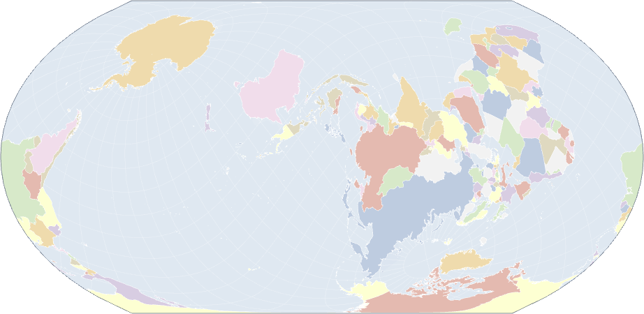
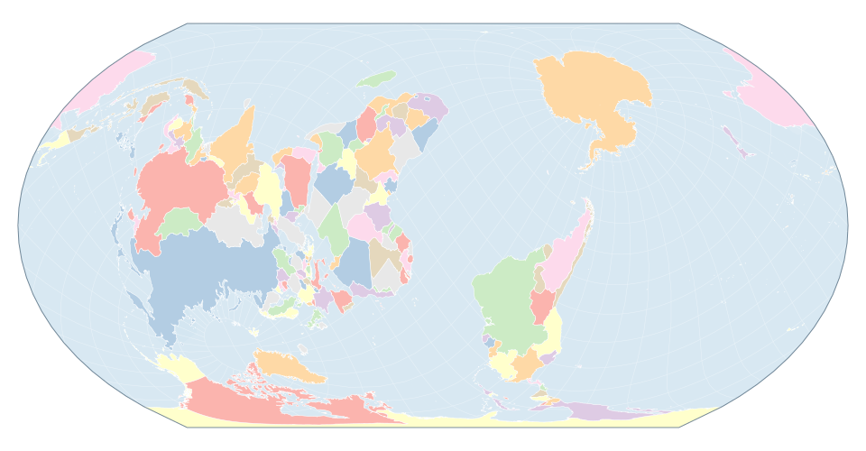
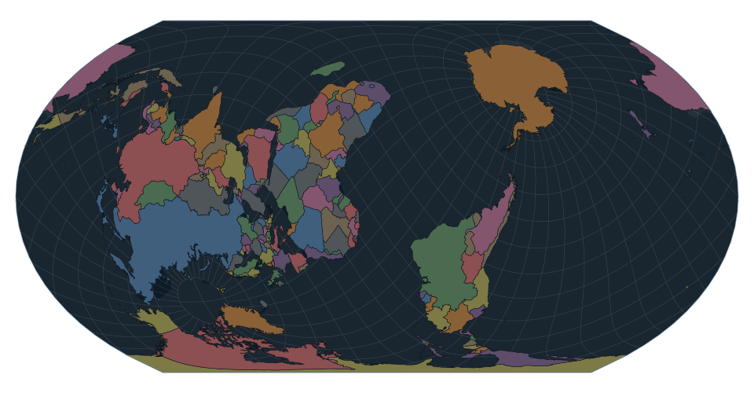

# Oblique Equal Earth

An equal-area world map you re-centre by **rotating the globe**, not by zooming.
It opens on the familiar north-up view and then **turns**, settling on an
oblique orientation — centred near 10°W 6°S and rolled 131°, which puts Africa
in the middle and upside down. That one movement is the argument: the view you
know is an orientation, not a fact. Watch the graticule curve as it goes; that
is the projection's own frame tilting away from the Earth's, which a simple
flip would never show. Readers who have asked for reduced motion get the final
view immediately.



*Nothing above is upside down by accident. That is the same Earth, turned — and
every country still covers its true share of the page.*

| Gesture | Effect |
|---|---|
| Drag | Swing the world under the projection. Whatever you grab stays under the cursor, over the poles and out the other side. |
| ⌘-drag / Ctrl-drag | Spin the map about the viewing axis, up to fully upside down. |
| Yaw / pitch / roll sliders | All three degrees of freedom, stacked with a live degree readout. Keyboard- and touch-drivable, and they track dragging. |
| Hover / click | Country **or ocean** name, then its Wikipedia article. |
| View picker | 51 preset orientations in 9 groups, each with an explanation and further reading. Clicking sweeps there smoothly. |
| Light / dark | Follows your system by default; buttons override it, and embedders can pin either. |
| ⓘ badges | One above the map for the gestures, one per axis. Hover or focus to read. |

Because `d3.geoEqualEarth().rotate()` transforms spherical coordinates *before*
projecting, rotating yields a genuinely **oblique** Equal Earth rather than a
panned one: the projection's zero-distortion line travels with you, so whichever
region you bring to the centre is the one drawn most faithfully. Watch the
graticule — once the parallels stop being horizontal lines, you are looking at
an oblique aspect.

Dragging composes quaternions rather than adding degrees to Euler angles, which
is what lets the map travel past a pole instead of jamming against it, and keeps
horizontal dragging following the cursor even when the world is upside down.

Country fills are chosen at build time by colouring the border graph, so no two
neighbouring countries share a colour.

## Quick start

```bash
npm install
npm run dev      # http://127.0.0.1:3000
```

The first run downloads and derives the map data; Framework caches the results
under `src/.observablehq/cache/`, so later runs are instant. `npm run clean`
drops that cache.

```bash
npm test         # 325 tests
npm run build    # static site -> dist/
```

`dist/` must be served over HTTP — the data loads via `fetch`, so opening
`dist/index.html` from the filesystem will not work.

Optional, for headless renders of the map to PNG:

```bash
npm install --no-save --legacy-peer-deps canvas
npm run snapshot
```

## Light and dark

The map follows your system preference and repaints live when it changes.
Buttons override it, and an embedder can pin either so the map matches the page
around it.

<p>
  
  
</p>

## Putting it on your own page

The map is a self-contained custom element — no framework required on your side.

```bash
npm run build            # derives the map data
npm run build:embed      # -> dist-embed/equal-earth.js (83 kB) + dist-embed/data/
```

Serve both, then:

```html
<script type="module" src="/equal-earth.js"></script>
<equal-earth-map data-base="/equal-earth-data" theme="auto"></equal-earth-map>
```

Or drive it yourself:

```js
import {mount} from "/equal-earth.js";

const controller = await mount(document.querySelector("#map"), {
  dataBase: "/equal-earth-data",
  theme: "dark",            // "auto" | "light" | "dark"
  rotation: [10, 6, 131],   // where the opening turn ends
  intro: true,              // false to skip the opening turn
  introDuration: 4000
});

controller.setTheme("auto");
controller.transitionTo([-10, -46, 0]);
controller.destroy();
```

Everything renders inside a shadow root, so the map cannot disturb your styles
and your styles cannot disturb the map. The map data stays external — it is
about 4.8 MB — so `data-base` points at wherever you serve it from.

This project's own page mounts the same component, so the embedding path is
exercised every time the site is opened rather than being a second, untested
way of assembling the same parts.

## Privacy

The built site makes **no third-party requests**. Observable Framework loads
Source Serif 4 from Google Fonts by default, which sends every visitor's IP
address to Google before the page renders; `globalStylesheets: []` removes it
and the local serif fallback takes over. External links in the page are ordinary
`<a href>` anchors — nothing is fetched unless you follow them.

`test/no-third-party.test.js` fails the build if a third-party subresource ever
reappears, so this is safe to deploy without post-processing the output.

## Data

| Layer | Source |
|---|---|
| Countries | [world-atlas](https://github.com/topojson/world-atlas) `countries-50m`, derived from Natural Earth |
| Country names, Wikidata ids | Natural Earth `ne_50m_admin_0_countries` |
| Oceans and seas | Natural Earth `ne_50m_geography_marine_polys` — 118 named water bodies |

[Natural Earth](https://www.naturalearthdata.com/about/terms-of-use/) is in the
public domain.

## Docs

- [`docs/notes.md`](docs/notes.md) — traps this codebase has already fallen into, most of which produce a passing build *and* a broken page.

## How this was built

**This project is entirely vibe coded.** Every line of source, test, comment and
documentation in this repository was written by **Claude Opus 5**
(model `claude-opus-5`, Anthropic) running in
[Claude Code](https://claude.com/claude-code), in a single conversation in
September 2026. The human contribution was direction, review and bug reports:
deciding what to build, choosing between options, spotting what looked wrong in
the browser, and saying when something was not good enough.

Worth knowing if you rely on this:

- The **explanatory texts** attached to the 51 preset views are AI-written
  popular-science prose. They have not been fact-checked by a domain expert.
  Treat them as a starting point, not as a citable source.
- The **test suite is real** — 248 tests, written test-first for most modules,
  and several guard failure modes that a green build would otherwise hide. It is
  the main reason to trust the code rather than the prose.
- Where the AI made mistakes, they are recorded in `docs/notes.md` rather than
  quietly fixed, because most of them are traps anyone would hit again.

## Licence

Copyright (C) 2026 Georg Ogris.

Licensed under the **GNU Affero General Public License, version 3 or later**
(AGPL-3.0-or-later). See [`LICENSE`](LICENSE).

The AGPL is copyleft: you may use, study, modify and redistribute this, but
derivative works must carry the same licence — and under section 13, if you run
a modified version on a **network server**, you must offer its source to the
users of that server. For a map that is meant to be deployed rather than
distributed, that is the clause that matters.

### Third-party

All runtime dependencies are permissively licensed and unaffected by the above;
their own licences continue to govern them.

| Package | Licence |
|---|---|
| `@observablehq/framework` | ISC |
| `d3`, `d3-geo`, `topojson-client`, `world-atlas`, `versor` | ISC |
| `vitest`, `rimraf` | MIT / ISC |
